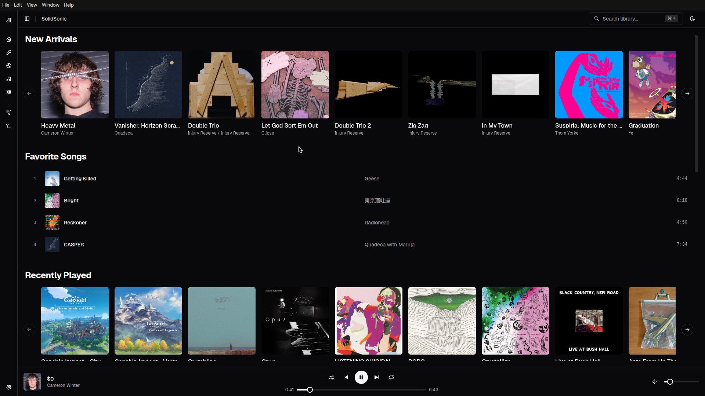
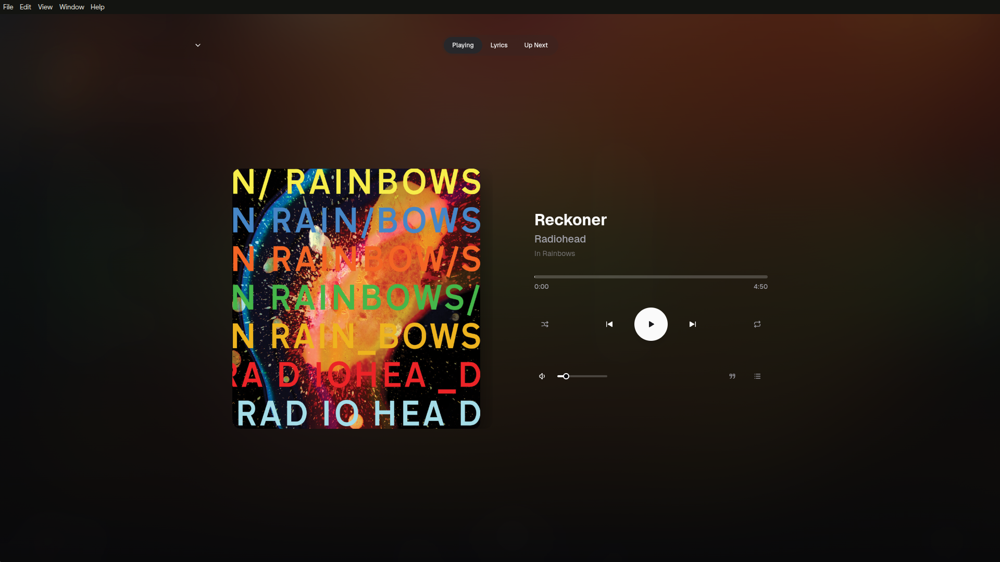

# SolidSonic

SolidSonic is a modern web music player for Subsonic and OpenSubsonic-compatible servers. It is built with SolidJS and focuses on fast navigation, responsive playback controls, and a clean music library experience in the browser.




## Features

- Subsonic/OpenSubsonic integration
- HTML5 audio playback
- Reactive UI with SolidJS and Tailwind CSS
- TanStack Router file-based routing
- TanStack Query data fetching and caching

## Tech Stack

- Frontend: [SolidJS](https://www.solidjs.com/)
- Routing: [TanStack Router](https://tanstack.com/router)
- Data fetching: [TanStack Query](https://tanstack.com/query)
- Styling: [Tailwind CSS](https://tailwindcss.com/)
- Linting/formatting: [Biome](https://biomejs.dev/)
- Build tool: [Vite](https://vitejs.dev/)

## Getting Started

### Prerequisites

- [Node.js](https://nodejs.org/) (latest LTS recommended)
- [Bun](https://bun.sh/) (optional)

### Installation

```bash
git clone https://github.com/imaviso/solidsonic.git
cd solidsonic
npm install
```

### Development

```bash
npm run dev
```

### Build

```bash
npm run build
npm run preview
```

## Testing and Quality

- Run tests: `npm run test`
- Lint and format checks: `npm run check`
- Auto-format: `npm run format`

## Project Structure

- `src/`: SolidJS application code
  - `src/components/`: reusable UI components
  - `src/lib/`: core logic (API, player, auth, settings)
  - `src/routes/`: file-based routes
  - `src/hooks/`: custom SolidJS hooks

## License

This project is licensed under the [MIT License](LICENSE).
